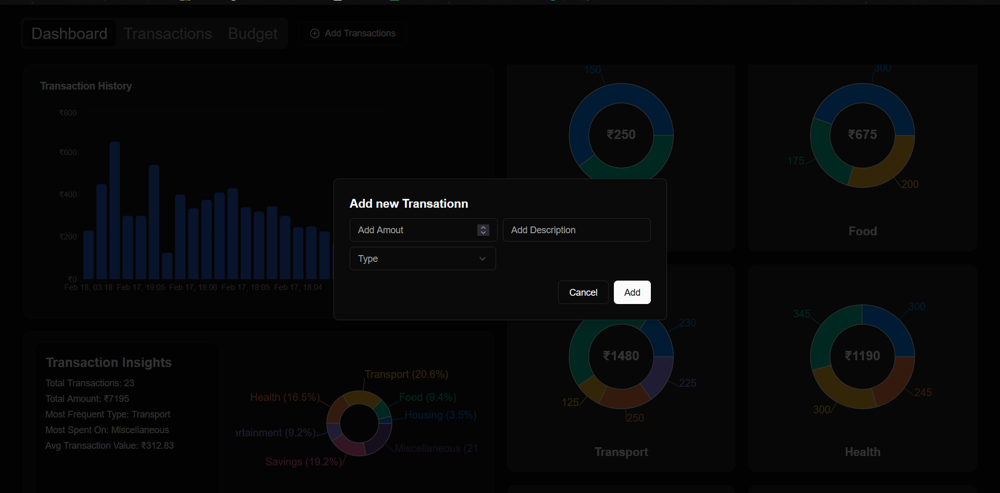

# Expense Tracker Application

## Overview

The Expense Tracker Application is designed to help users manage their finances by tracking expenses, categorizing them, and setting budgets. The application is built using Next.js, React, shadcn/ui, Recharts, and MongoDB. It features a responsive design to ensure usability across various devices.

## Features

- **Add/Edit/Delete Transactions**: Users can add, edit, or delete transactions with details such as amount, date, and description.
- **Transaction List View**: View a list of all transactions.
- **Monthly Expenses Bar Chart**: Visualize monthly expenses using a bar chart.
- **Basic Form Validation**: Ensure data integrity with basic form validation.
- **Predefined Categories**: Transactions can be categorized using predefined categories.
- **Category-wise Pie Chart**: Visualize expenses by category using a pie chart.
- **Dashboard**: Summary cards displaying total expenses, category breakdown, and most recent transactions.
- **Set Monthly Category Budgets**: Users can set monthly budgets for each category.
- **Budget vs Actual Comparison Chart**: Compare budgeted amounts with actual expenses.
- **Spending Insights**: Gain insights into spending habits with simple analytics.

## API Endpoints

- **POST /api/createExpense**: Create a new expense.
  - Body: `{ amount, description, type }`

- **POST /api/deleteExpense**: Delete an expense by ID.
  - Body: `{ id }`

- **PATCH /api/editExpense**: Edit an existing expense.
  - Body: `{ id, amount, description, type }`

- **GET /api/getExpense**: Retrieve a list of expenses.

- **GET /api/getBudget**: Retrieve the current budget.

- **POST /api/setBudget**: Set a new budget.
  - Body: `{ type, budget }`

## Tech Stack

- **Frontend**: Next.js, React, shadcn/ui, Recharts
- **Backend**: Next.js API routes
- **Database**: MongoDB
- **Styling**: Tailwind CSS (or any other CSS framework you prefer)

## Screenshots





## Installation

1. **Clone the Repository**:
   ```bash
   git clone https://github.com/vaibhavBhardwaj24/finance-dashboard
   cd expense-tracker
